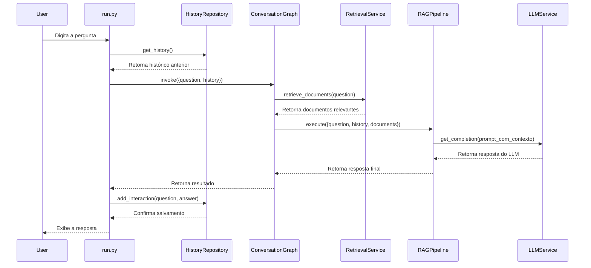

# Relatório Técnico: Qualichat Intelligence (MVP)

## 1. Visão Geral do Projeto

### 1.1. Objetivo
O projeto `qualichat_intelligence` visa criar o backend de IA conversacional para o Qualichat. O sistema foi projetado para ser modular, extensível e capaz de executar fluxos de conversa complexos, utilizando uma arquitetura de **Geração Aumentada por Recuperação (RAG)** para fornecer respostas precisas e contextualizadas.

### 1.2. Escopo do MVP
O estado atual do projeto constitui um **MVP (Minimum Viable Product)** funcional, que inclui:
- Um pipeline RAG completo, desde a recepção da pergunta até a geração da resposta.
- Persistência de histórico de conversas em armazenamento local.
- Um terminal interativo para testes e depuração do fluxo de ponta a ponta.
- Uma base de código desacoplada, pronta para futuras expansões como a implementação de uma API REST e a integração de fluxos de RAG mais avançados.

### 1.3. Decisões de Arquitetura
- **Modularidade:** O código é estritamente separado em camadas (core, models, repositories, services, graphs), garantindo baixo acoplamento e alta coesão.
- **Design Patterns:** Foram aplicados padrões como **Factory** (em `app/core/factory.py`) para centralizar a criação de objetos e **Repository** (em `app/repositories/`) para abstrair o acesso a dados, permitindo a troca de implementações (ex: trocar ChromaDB por Pinecone) sem impactar a lógica de negócio.
- **Serverless-Ready:** A arquitetura não depende de estado em memória entre requisições, o que a torna inerentemente compatível com ambientes serverless (como AWS Lambda ou Google Cloud Functions) quando uma API for implementada.

---

## 2. Stack Técnica e Dependências

- **Linguagem:** Python 3.10+
- **Gerenciador de Dependências:** Poetry
- **Orquestração de Fluxos:** LangChain e LangGraph
- **Camada de LLMs e Embeddings:** LiteLLM, que atua como uma interface unificada para múltiplos provedores (OpenAI, Anthropic, etc.).
- **Banco Vetorial:** ChromaDB (para persistência local de embeddings). A arquitetura permite a substituição futura por soluções como Pinecone ou Weaviate.
- **Validação de Dados:** Pydantic, usado para definir modelos de dados robustos e tipados.
- **Ambiente de Execução:** O projeto inclui um `Dockerfile` para facilitar o deploy em contêineres.

---

## 3. Arquitetura e Camadas

A estrutura de diretórios reflete a separação de responsabilidades:

```
qualichat_intelligence/
├── app/
│   ├── core/         # Configuração, logger e factories
│   ├── graphs/       # Orquestração de fluxos com LangGraph
│   ├── models/       # Modelos de dados (Pydantic)
│   ├── repositories/ # Camada de acesso a dados
│   └── services/     # Lógica de negócio
└── run.py            # Ponto de entrada interativo
```

- **`app/core`:** Contém a lógica central da aplicação.
  - `config.py`: Carrega configurações do ambiente (`.env`) usando Pydantic.
  - `logger.py`: Configura um logger global com Loguru.
  - `factory.py`: Centraliza a criação de serviços e repositórios.
- **`app/models`:** Define as entidades de dados.
  - `HistoryItem`: Representa uma interação de chat.
  - `Document`: Representa um documento para o RAG.
  - `Embedding`: Representa o vetor de um documento.
- **`app/repositories`:** Abstrai a persistência de dados.
  - `ChromaRepository`: Gerencia o armazenamento e a busca de vetores no ChromaDB.
  - `HistoryRepository`: Gerencia a persistência do histórico de conversas em um arquivo JSON.
- **`app/services`:** Contém a lógica de negócio.
  - `LLMService` / `EmbeddingsService`: Interagem com o LiteLLM.
  - `RetrievalService`: Orquestra a busca de documentos no `ChromaRepository`.
  - `RAGPipeline`: Combina o contexto recuperado com a pergunta para gerar a resposta final.
- **`app/graphs`:** Orquestra os serviços em um fluxo de estados.
  - `ConversationGraph`: Define os nós (recuperar contexto, gerar resposta) e as arestas do fluxo de conversação.
- **`run.py`:** Ponto de entrada que executa um terminal interativo para testes.

---

## 4. Fluxos de Dados

O fluxo de uma pergunta do usuário através do sistema é linear e orquestrado pelo `ConversationGraph`.



- **Cálculo de Embeddings:** Os embeddings são calculados sob demanda pelo `EmbeddingsService` quando:
  1.  Novos documentos são adicionados ao `ChromaRepository` (ainda não implementado no fluxo de ingestão).
  2.  Uma nova pergunta é feita, para que seu vetor possa ser usado na busca por similaridade no `ChromaRepository`.

---

## 5. Histórico e Persistência

- **Estrutura:** O histórico é modelado pelo `HistoryItem` (`app/models/history.py`), que armazena a mensagem do usuário, a resposta do bot, um timestamp e metadados opcionais.
- **Uso:** A cada nova pergunta, o histórico completo é recuperado pelo `HistoryRepository` e injetado no prompt enviado ao LLM, fornecendo o contexto da conversa.
- **Persistência:** Atualmente, o histórico é salvo em um arquivo `chat_history.json`, gerenciado pelo `HistoryRepository`.
- **Limitações Atuais:**
  - A persistência é local e não adequada para múltiplos usuários ou instâncias.
  - O histórico é enviado na íntegra a cada chamada, o que pode atingir limites de tokens em conversas muito longas.

---

## 6. Observações de Extensibilidade

A arquitetura atual foi projetada para ser altamente extensível:
- **Troca de Banco Vetorial:** Para usar o Pinecone, bastaria criar um `PineconeRepository` que implemente a mesma interface e atualizar a `ServiceFactory`.
- **Múltiplos Provedores de LLM:** O LiteLLM já permite a troca de modelos (ex: `gpt-4` para `claude-3`) via configuração no `.env`, sem alteração de código.
- **API REST:** A lógica de negócio está desacoplada da interface. É possível adicionar endpoints FastAPI que chamem o `ConversationGraph` com mínima refatoração.
- **RAG Avançado:** O `ConversationGraph` pode ser facilmente expandido com novos nós para implementar técnicas como GraphRAG, Self-Correction ou uso de ferramentas (Tools).

---

## 7. Pontos Pendentes

- **Testes:** Não há uma suíte de testes unitários ou de integração.
- **Ingestão de Dados:** Falta um fluxo para popular o `ChromaRepository` com documentos.
- **API REST:** O sistema só pode ser acessado via terminal interativo.
- **Persistência Avançada:** O histórico em JSON deve ser substituído por um banco de dados mais robusto (ex: SQLite, PostgreSQL) para produção.
- **Observabilidade:** O log é apenas local. Para produção, seria necessário um sistema de log centralizado (ex: ELK, Datadog).
- **Fluxo Completo:** A lógica de negócio completa, como a descrita em diagramas de fluxo (ex: Lucidchart), ainda não foi totalmente implementada no `ConversationGraph`.
